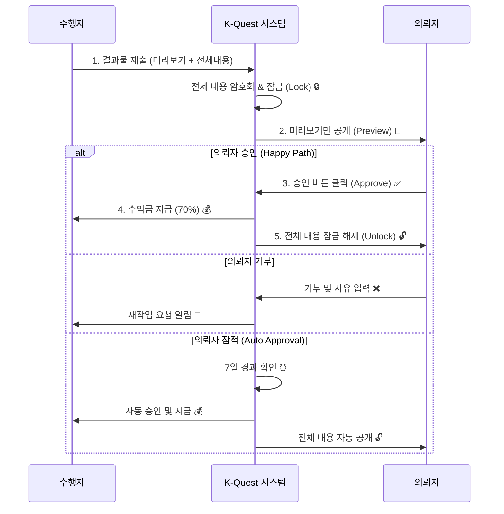

# 🛡️ K-Quest 의뢰자 먹튀 방지 시스템 (Anti-Fraud)

## 🚨 문제 정의
수행자가 열심히 Quest를 수행했으나, 의뢰자가 결과물만 확인하고 결제 승인을 하지 않거나 잠적하는 "먹튀" 행위를 원천 차단합니다.

---

## 🔒 핵심 솔루션: 단계별 공개 시스템 (Phased Release)

### 1. 미리보기 (Preview) vs 전체 내용 (Full Content)
수행자는 결과물을 제출할 때 두 가지로 나누어 제출합니다.

| 구분 | 공개 시점 | 내용 예시 |
|------|----------|-----------|
| **미리보기 (Preview)** | **즉시 공개** | 작업 완료 증명 스크린샷, 요약, 일부 데이터 |
| **전체 내용 (Full Content)** | **🔒 결제 승인 후** | 전체 조사 자료, 원본 파일, 계정 정보, 상세 리포트 |

### 2. 에스크로 락 (Escrow Lock)
- 결제된 금액은 플랫폼의 안전한 에스크로 계좌에 **Lock** 됩니다.
- 의뢰자가 승인하기 전까지는 누구도 돈을 가져갈 수 없습니다.
- 의뢰자가 승인하면 **즉시** 수행자에게 지급됩니다.

### 3. 자동 승인 시스템 (Auto-Approval)
- 의뢰자가 결과물을 받고도 아무런 조치를 취하지 않으면?
- **7일 후 자동으로 승인** 처리되어 수행자에게 수익이 지급됩니다.
- 의뢰자는 7일 이내에 승인하거나, 정당한 사유로 거부해야 합니다.

---

## 🔄 프로세스 흐름

---

## 🛠️ 기술적 구현 상세

### 1. 데이터베이스 (`supabase_anti_fraud.sql`)
- `quest_deliverables`: 결과물 저장 테이블. `is_preview_mode` 플래그로 접근 제어.
- `escrow_locks`: 결제 금액 잠금 관리. `auto_release_at`으로 자동 승인 시간 관리.
- `client_reputation`: 의뢰자 신뢰도 점수 및 블랙리스트 관리.

### 2. API 엔드포인트
- `POST /api/submit-deliverable`: 수행자가 결과물 제출 (미리보기/전체 분리).
- `POST /api/approve-deliverable`: 의뢰자가 승인/거부 처리.
- `GET /api/submit-deliverable`: 권한에 따라 미리보기 또는 전체 내용 반환.

### 3. UI 컴포넌트
- `DeliverableSubmissionForm`: 수행자용 제출 폼.
- `DeliverableReview`: 의뢰자용 검토 화면 (잠금 화면 포함).

---

## 🚫 악성 의뢰자 제재 (Blacklist)

### 신뢰도 점수 (Trust Score)
- 모든 의뢰자는 100점에서 시작합니다.
- 정당한 사유 없는 거부 반복 시 점수 차감.
- 승인율이 20% 미만으로 떨어지면 **자동 블랙리스트** 등재.

### 분쟁 해결 (Dispute)
- 의뢰자가 부당하게 거부하거나, 수행자가 허위 결과물을 제출하면 분쟁 제기 가능.
- 관리자가 개입하여 증거(미리보기, 대화 내용)를 바탕으로 판결.

---

## ✅ 사용 가이드

### 수행자 (Performer)
1. Quest 완료 후 `결과물 제출` 버튼 클릭.
2. **미리보기**: 의뢰자가 "아, 작업이 다 됐구나"라고 알 수 있을 정도만 입력하세요. (예: 흐릿한 이미지, 요약본)
3. **전체 내용**: 실제 돈을 받고 넘겨줄 모든 자료를 입력하세요. 이 내용은 안전하게 보호됩니다.

### 의뢰자 (Client)
1. 알림을 받으면 결과물 확인 페이지로 이동.
2. **미리보기**를 통해 작업 퀄리티 확인.
3. 만족스러우면 `승인하고 전체 보기` 클릭 → 즉시 결제 완료 및 전체 내용 확인 가능.
4. 부족하면 `수정 요청` 클릭 → 사유 입력.

---

## 🚀 배포 전 체크리스트
- [ ] `supabase_anti_fraud.sql` 실행 완료
- [ ] 크론잡(Cron Job) 설정 (자동 승인용)
- [ ] 알림 시스템 연동 확인

---

**작성일:** 2024-12-02  
**상태:** ✅ 구현 완료
