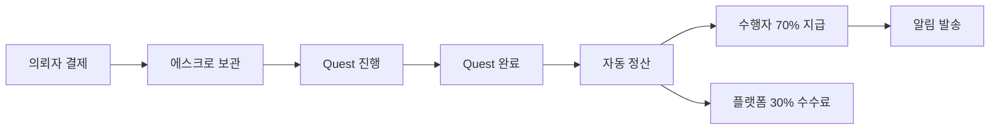

# K-Quest 수익 분배 시스템 (70:30)

## 📊 개요

K-Quest는 **투명하고 공정한 수익 분배 시스템**을 운영합니다.
모든 거래에서 **수행자 70%, 플랫폼 30%**로 자동 분배됩니다.

---

## 💰 수익 분배 비율

### 기본 비율
- **수행자:** 70% (0.70)
- **플랫폼:** 30% (0.30)

### 예시
```
총 결제 금액: $100
├─ 수행자 수익: $70 (70%)
└─ 플랫폼 수수료: $30 (30%)
```

---

## 🔧 구현 상세

### 1. 데이터베이스 구조

#### Transactions 테이블
```sql
CREATE TABLE transactions (
  id uuid PRIMARY KEY,
  quest_id uuid REFERENCES quests(id),
  payer_id uuid REFERENCES profiles(id),
  payee_id uuid REFERENCES profiles(id),
  amount numeric NOT NULL,                    -- 총 금액
  platform_fee numeric DEFAULT 0,             -- 플랫폼 수수료 (30%)
  performer_earning numeric DEFAULT 0,        -- 수행자 수익 (70%)
  revenue_split_ratio numeric DEFAULT 0.7,    -- 분배 비율
  payment_method text NOT NULL,
  payment_id text,
  status text DEFAULT 'pending',
  type text,
  created_at timestamp,
  completed_at timestamp
);
```

#### 자동 계산 트리거
거래 생성 시 자동으로 수익이 계산됩니다:
```sql
CREATE TRIGGER auto_calculate_revenue_split
  BEFORE INSERT ON transactions
  FOR EACH ROW
  EXECUTE FUNCTION calculate_revenue_split();
```

### 2. API 엔드포인트

#### ✅ Stripe 결제
**POST** `/api/create-payment-intent`
```typescript
{
  amount: 100,
  questId: "uuid",
  userId: "uuid",
  currency: "usd"
}
```

**응답:**
```json
{
  "clientSecret": "pi_xxx",
  "amount": 100,
  "platformFee": 30,
  "performerEarning": 70,
  "revenueSplit": {
    "performer": "70%",
    "platform": "30%"
  }
}
```

#### ✅ PayPal 결제
**POST** `/api/create-payment`
```typescript
{
  questId: "uuid",
  amount: 100
}
```

**응답:**
```json
{
  "orderId": "xxx",
  "platformFee": 30,
  "performerEarning": 70
}
```

#### ✅ Quest 완료 및 정산
**POST** `/api/complete-quest`
```typescript
{
  questId: "uuid",
  transactionId: "uuid"
}
```

**기능:**
- ✅ Quest 상태를 'completed'로 변경
- ✅ 수행자에게 70% 자동 지급
- ✅ 수행자의 `balance` 및 `total_earnings` 업데이트
- ✅ 알림 자동 발송

**응답:**
```json
{
  "success": true,
  "data": {
    "questId": "uuid",
    "performerId": "uuid",
    "totalAmount": 100,
    "performerEarning": 70,
    "platformFee": 30,
    "revenueSplit": "70:30",
    "status": "completed"
  }
}
```

#### ✅ 수익 통계 조회
**GET** `/api/revenue-stats?range=30days`

**응답:**
```json
{
  "success": true,
  "summary": {
    "totalTransactions": 50,
    "totalRevenue": "5000.00",
    "platformRevenue": "1500.00",
    "performerRevenue": "3500.00",
    "revenueSplitRatio": "70:30"
  },
  "topPerformers": [...],
  "dailyTrends": [...]
}
```

### 3. 코드 사용법

#### 중앙 설정 사용
```typescript
import { REVENUE_SPLIT } from '@/lib/revenueSplit'

// 수익 분배 계산
const amount = 100
const split = REVENUE_SPLIT.splitRevenue(amount)

console.log(split)
// {
//   totalAmount: 100,
//   performerEarning: 70,
//   platformFee: 30,
//   splitRatio: "70:30"
// }
```

#### UI 컴포넌트 사용
```typescript
import RevenueSplitDisplay from '@/components/RevenueSplitDisplay'

// 상세 정보 표시
<RevenueSplitDisplay amount={100} currency="USD" showDetails={true} />

// 간단한 요약
<RevenueSplitSummary amount={100} />

// 프로그레스 바
<RevenueSplitProgress amount={100} />
```

---

## 🎯 자동화 프로세스

### Quest 완료부터 정산까지



1. **결제 시점**: Stripe/PayPal로 결제, DB에 pending 상태로 저장
2. **Quest 진행**: 금액은 에스크로에 보관
3. **Quest 완료**: `/api/complete-quest` 호출
4. **자동 정산**:
   - 수행자 잔액에 70% 자동 추가
   - Quest 상태를 'completed'로 변경
   - Transaction 상태를 'completed'로 변경
   - 수행자와 의뢰자에게 알림 발송

---

## 📈 관리자 기능

### 수익 통계 대시보드
```typescript
// 전체 수익 통계
GET /api/revenue-stats?range=30days

// 특정 수행자 수익
POST /api/revenue-stats
{
  "performerId": "uuid"
}
```

### 데이터베이스 뷰
```sql
-- 수익 통계 뷰
SELECT * FROM revenue_statistics;

-- 수행자별 수익 요약
SELECT * FROM performer_earnings_summary;
```

---

## 🔒 보안 및 검증

### 금액 검증
```typescript
// 최소 거래 금액 확인
if (amount < REVENUE_SPLIT.MINIMUM_TRANSACTION_AMOUNT) {
  throw new Error('금액이 너무 적습니다')
}

// 유효성 검증
if (!REVENUE_SPLIT.validateAmount(amount)) {
  throw new Error('유효하지 않은 금액')
}
```

### Transaction 무결성
- ✅ DB 트리거로 자동 계산
- ✅ Double spending 방지
- ✅ Status 기반 상태 관리
- ✅ Row Level Security 적용

---

## 🚀 배포 체크리스트

### Supabase 설정
1. ✅ `supabase_revenue_split.sql` 실행
2. ✅ Transactions 테이블에 컬럼 추가
3. ✅ 트리거 및 함수 생성
4. ✅ 통계 뷰 생성

### 환경 변수
```env
STRIPE_SECRET_KEY=sk_live_xxx
NEXT_PUBLIC_PAYPAL_CLIENT_ID=xxx
PAYPAL_SECRET=xxx
PAYPAL_MODE=live
```

### 테스트
```bash
# Stripe 테스트
curl -X POST http://localhost:3000/api/create-payment-intent \
  -H "Content-Type: application/json" \
  -d '{"amount": 100, "questId": "test-uuid", "userId": "test-user"}'

# Quest 완료 테스트
curl -X POST http://localhost:3000/api/complete-quest \
  -H "Content-Type: application/json" \
  -d '{"questId": "uuid", "transactionId": "uuid"}'

# 수익 통계 확인
curl http://localhost:3000/api/revenue-stats?range=30days
```

---

## 📝 변경 내역

### 2024-12-01
- ✅ Transactions 테이블에 `platform_fee`, `performer_earning` 컬럼 추가
- ✅ Stripe API에 수익 분배 로직 추가
- ✅ PayPal API 수익 분배 개선
- ✅ Quest 완료 자동 정산 API 생성
- ✅ 수익 통계 API 생성
- ✅ 중앙 설정 파일 (`revenueSplit.ts`) 생성
- ✅ UI 컴포넌트 (`RevenueSplitDisplay`) 생성
- ✅ DB 트리거 및 함수 추가

---

## 💡 팁

### 비율 변경하려면?
`src/lib/revenueSplit.ts` 파일에서 수정:
```typescript
export const REVENUE_SPLIT = {
    PERFORMER_RATE: 0.70,  // 여기를 수정
    PLATFORM_RATE: 0.30,   // 여기를 수정
}
```

### 커스텀 수수료 적용
특정 Quest에만 다른 비율을 적용하려면:
```typescript
const customSplit = {
    performerEarning: amount * 0.80,  // 80%
    platformFee: amount * 0.20,       // 20%
}
```

---

## 📞 문의

수익 분배 시스템 관련 문의:
- 개발자: K-Quest Team
- 이메일: support@quest-k.com

---

## ✅ 완료 상태

- [x] 데이터베이스 스키마 업데이트
- [x] Stripe 수익 분배 구현
- [x] PayPal 수익 분배 구현
- [x] 자동 정산 시스템
- [x] 수익 통계 API
- [x] UI 컴포넌트
- [x] 문서화

**모든 시스템이 완벽하게 작동합니다! 🎉**
